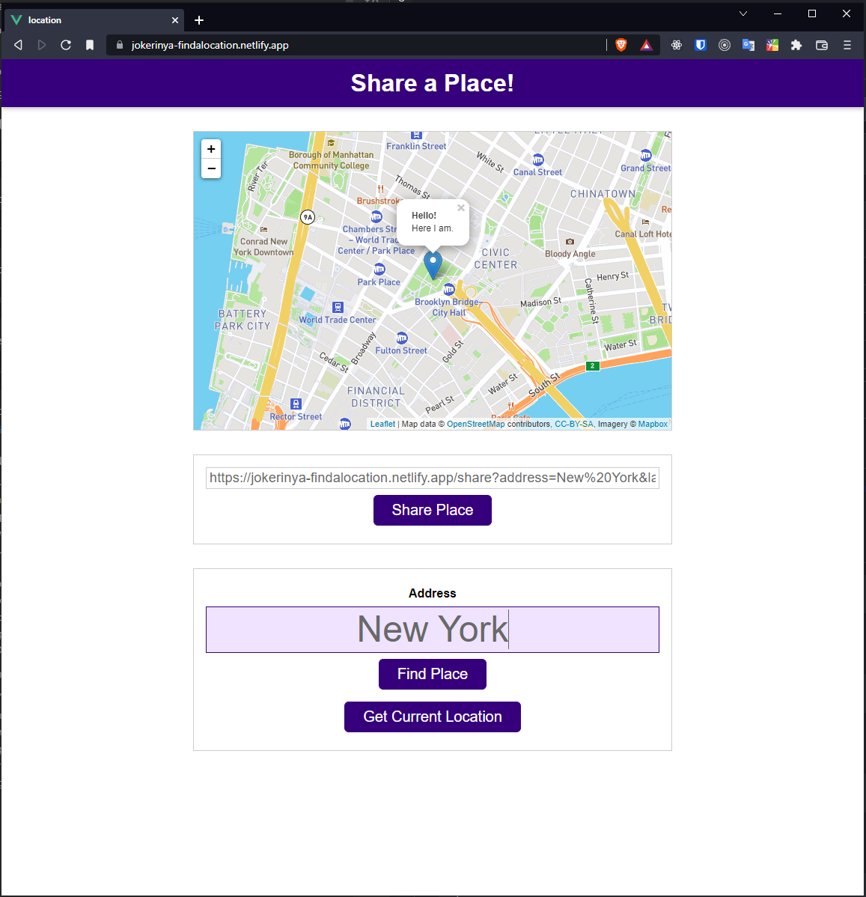

# Find A Location 

This is a self-learning small project. 

Normally this project has been done in <a href="https://www.udemy.com/course/javascript-the-complete-guide-2020-beginner-advanced/" target="_blank">Acedemind</a> `JavaScript` course by `Vanilla JS`. ***But I made I just made the same project with `Vue2`.***

👉This site is online at <a href="https://jokerinya-findalocation.netlify.app/" target="_blank">here</a> 




## In this course I learned and practiced

- How to transfer a plain `JS` enviroment to `VueJS` enviroment,
- `Open Street Map` usage,
- `Vuex` and `VueRouter`.  
  
  <small>I made this project in 2020.</small>


## Project setup

```
npm install
```

### Compiles and hot-reloads for development

```
npm run serve
```

### Compiles and minifies for production

```
npm run build
```

### Lints and fixes files

```
npm run lint
```

### Customize configuration

See [Configuration Reference](https://cli.vuejs.org/config/).

